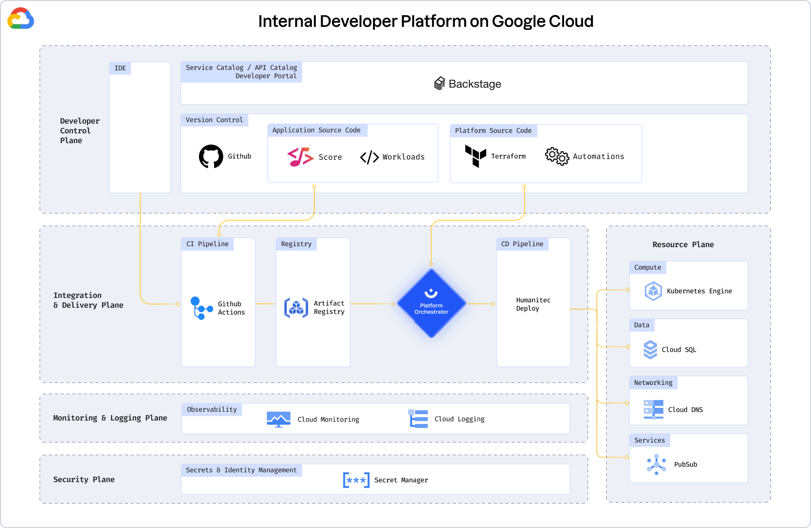

# Humanitec Google Cloud Reference Architecture Implementation

This repo contains an implementation of part of the Humanitec Reference Architecture for an Internal Developer Platform.



This repo covers the base layer of the implementation for Google Cloud (GCP).

By default, the following will be provisioned:

- VPC
- GKE Autopilot Cluster
- Google Service Account to access the cluster
- Ingress NGINX in the cluster
- Resource Definitions in Humanitec for:
  - Kubernetes Cluster
  - Logging

## Prerequisites

* A Humanitec account with the `Administrator` role in an Organization. Get a [free trial](https://humanitec.com/free-trial?utm_source=github&utm_medium=referral&utm_campaign=gcp_refarch_repo) if you are just starting.
* A GCP project
* [gcloud CLI](https://cloud.google.com/cli) installed locally
* [Terraform](https://www.terraform.io/) installed locally

## Usage

**Note: Using this Reference Architecture Implementation will incur costs for your GCP project.**

It is recommended that you fully review the code before you run it to ensure you understand the impact of provisioning this infrastructure.
Humanitec does not take responsibility for any costs incurred or damage caused when using the Reference Architecture Implementation.

This reference architecture implementation uses Terraform. You will need to do the following:

1. [Fork this GitHub repo](https://github.com/humanitec-architecture/reference-architecture-gcp/fork), clone it to your local machine and navigate to the root of the repository.

2. Set the required input variables (see [Required input variables](#required-input-variables)).

3. Ensure you are logged in with `gcloud` (See: [gcloud auth application-default login](https://cloud.google.com/sdk/gcloud/reference/auth/application-default)).

   You will need to ensure your Google Cloud account has appropriate permissions on the project you wish to provision in.

4. Set the `HUMANITEC_TOKEN` environment variable to an appropriate Humanitec API token with the `Administrator` role on the Humanitec Organization.

   For example:

   ```
   export HUMANITEC_TOKEN="my-humanitec-api-token"
   ```

5. Run terraform:

   ```
   terraform init
   terraform plan
   terraform apply
   ```

### Required input variables

Terraform reads variables by default from a file called `terraform.tfvars`. You can create your own file by renaming the `terraform.tfvars.example` file in the root of the repo and then filling in the missing values.

The following variables are required and so need to be set:

| Variable | Type | Description | Example |
| --- | --- | --- | --- |
| `project_id` | `string` | The GCP project provision the infrastructure in. | `"my-gcp-project"` |
| `region` | `string` | The GCP region to provision the infrastructure in. | `"us-west1"` |
| `humanitec_org_id` | `string` | The ID of the Humanitec Organization the cluster should be associated with. | `"my-org"` |

There are many other optional inputs that can be set. The full list is described in [Optional input variables](#optional-input-variables).

## Verify your result

Check for the existence of key elements of the reference architecture. This is a subset of all elements only. For a complete list of what was installed, review the Terraform code.

1. Set the `HUMANITEC_ORG` environment variable to the ID of your Humanitec Organization (must be all lowercase):
```bash
export HUMANITEC_ORG="my-humanitec-org"   
```

2. Verify the existence of the Resource Definition for the GKE cluster in your Humanitec Organization:
```bash
curl -s https://api.humanitec.io/orgs/${HUMANITEC_ORG}/resources/defs/htc-ref-arch-cluster \
  --header "Authorization: Bearer ${HUMANITEC_TOKEN}" \
  | jq .id,.type
```
This should output:
```bash
"htc-ref-arch-cluster"
"k8s-cluster"
```

3. Verify the existence of the newly created GKE cluster:

```bash
gcloud container clusters list --filter "name=htc-ref-arch-cluster"
```
This should output cluster data like this:
```bash
NAME                  LOCATION       MASTER_VERSION  MASTER_IP       MACHINE_TYPE    NODE_VERSION    NUM_NODES  STATUS
htc-ref-arch-cluster  <your-region>  xx.xx.xx-gke.xx xx.xx.xx.xx     n2d-standard-4  xx.xx.xx-gke.xx 3          RUNNING
```

## Cleaning up

Once you are finished with the reference architecture, you can remove all provisioned infrastructure and the resource definitions created in Humanitec with the following:

1. Ensure you are (still) logged in with `gcloud`.

2. Ensure you still have the `HUMANITEC_TOKEN` environment variable set to an appropriate Humanitec API token with the `Administrator` role on the Humanitec Organization.
  
   You can verify this in the UI if you log in with an Administrator user and go to Resource Management, and check the "Usage" of each resource definition with the prefix set in `humanitec_prefix` - by default this is `htc-ref-arch-`.

3. Run terraform:

   ```
   terraform destroy
   ```

## Advanced usage

### Optional input variables

In addition to the 3 required input variables described in [Required input variables](#required-input-variables), this implementation supports many more that change the behavior of the provisioning of infrastructure. 

### Tagging & ID generation

| Variable | Type | Description | Default |
| --- | --- | --- | --- |
| `humanitec_prefix` | `string` | A prefix that will be attached to all IDs created in Humanitec | `""` |
